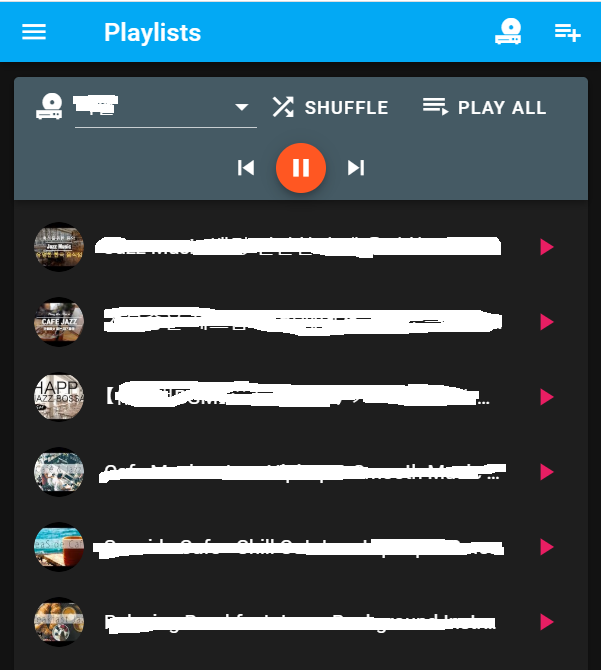
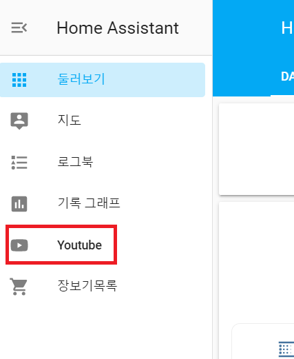
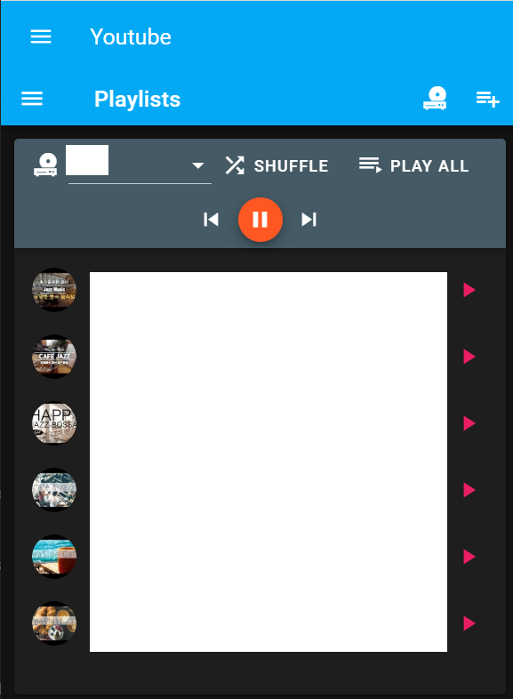

# yt-player

Get music playlist from Youtube and play music using home assistant API.

## Project setup
```
cd ./front-end
npm install
npm run build
cd ../back-end
npm install
```

### Project settings
make `./back-end/config/property.js` refering below example
```js
module.exports = {
  redis_host: 'redis',
  redis_port: '6379',
  google_api_key: 'GOOGLE_API_KEY',
  hass_api_key: 'HOME_ASSISTANT_API_KEY',
  HASS_DNS: 'https://YOUR_HA_DNS'
}
```

### Run application
```
cd ./back-end
npm start
```

### Screenshot


## Link with Home Assistant Docker

### Prerequirements
- docker platform
- docker-compose
- Nginx for your home network (Recommanded)

### Settings
1. Install redis
  ```yml
  # Sample docker-compose.yml
  version: "3.5"

  services:
    redis:
      image: redis:alpine3.11
      container_name: redis
      volumes:
        - "/storage/redis:/data"
      ports: 
        - 26379:6379
      networks:
        - backend
      restart: always
      entrypoint: redis-server --appendonly yes
  networks:
    backend:
      driver: bridge
  ```
2. Install yt-player by dockerfile
  ```yml
  # Sample docker-compose.yml
  version: "3.5"

  services:
    yt-player:
      image: gaussian8/yt-player:1.0
      container_name: yt-player
      volumes:
        - "./property.js:/app/back-end/config/property.js:ro"
      ports: 
        - 6001:3000
      restart: always
  networks:
    default:
      external:
        name: redis_backend
  ```
3. Modify homeassistant config file refering below
- `configuration.yml`
  ```yml
  # Sample
  media_extractor:

  panel_iframe:
    yt_player:
      title: 'Youtube'
      icon: mdi:youtube
      url: 'https://YOUR_YT_PLAYER_DOMAIN'

  rest_command:
    play_media_next:
      url: http://localhost:6001/api/entities/{{entity_id}}/next
      method: POST

    play_media_stop:
      url: http://localhost:6001/api/entities/{{entity_id}}/stop
      method: POST

  automation:
    - alias: NextMusic
      description: ''
      trigger:
      - entity_id: YOUR_MEDIA_PLAYER_ENTITY_ID
        from: playing
        platform: state
        to: idle
      condition: []
      action:
      - data:
          entity_id: YOUR_MEDIA_PLAYER_ENTITY_ID
        service: rest_command.play_media_next
    - alias: StopMusic
      description: ''
      trigger:
      - entity_id: YOUR_MEDIA_PLAYER_ENTITY_ID
        from: palying
        platform: state
        to: 'off'
      - entity_id: YOUR_MEDIA_PLAYER_ENTITY_ID
        from: paused
        platform: state
        to: 'off'
      condition: []
      action:
      - data:
          entity_id: YOUR_MEDIA_PLAYER_ENTITY_ID
        service: rest_command.play_media_stop

  ```
4. Add nginx reverse proxy for yt-player
  ```conf
  location /youtube/ {
    proxy_pass http://localhost:6001/;
    proxy_set_header Host $host;

    # For security
    allow YOUR_PUBLIC_IP;
    allow 192.168.1.0/24;
    deny all;
  }
  ```
### Screenshot

