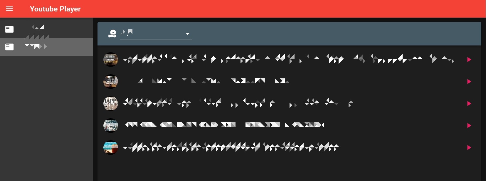

# yt-playlist

Get music playlist from Youtube and play music using home assistant API.

## Project setup
```
npm install
```

### Project settings
make `./src/assets/property.json` like this
```json
{
  "google_api_key": "[YOUR_YOUTUBE_DATA_API_KEY]",
  "hass_api_key": "[YOUR_HASS_API_KEY]",
  "entities": [
    {"text": "foo", "value": "media_player.foo"},
    {"text": "bar", "value": "media_player.bar"},
    ...
  ],
  "playlists": [
    { "icon": "featured_play_list", "text": "playlist1", "to": "[YOUR_PLAYLIST_ID]" },
    { "icon": "featured_play_list", "text": "playlist2", "to": "[YOUR_PLAYLIST_ID]" },
    ...
  ],
  "HASS_DNS": "https://[YOUR_HOMEASSISTANT_DOMAIN]"
}
```

### Compiles and hot-reloads for development
```
npm run serve
```

### Compiles and minifies for production
```
npm run build
```

### Screenshot
